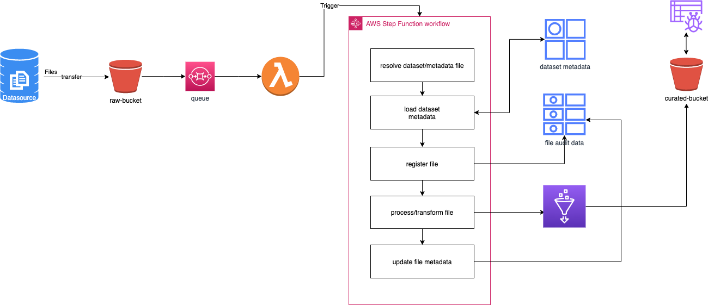

# AWS ETL Demo

Demonstrates serverless AWS based ETL pipeline

## Steps

1. The ETL pipeline starts when source sends the data file in the RAW bucket
2. To control batch or event based execution of the pipeline, the s3 key of the incoming file is queued in an FIFO SQS queue
3. Lambda listens to the queue for event based pattern or can be scheduled using a cron expression for batch based pattern
4. Lambda triggers step function with payload (s3 key/path) of the file
5. Stepfunction orechestrates the ETL flow and uses Lambda tasks to perform functions
6. The ETL code is ported into Glue job (potentially using PySpark)
7. DynamoDB table to store the metadata of file
8. DynamoDB to keep audit history of pipeline exeuction
9. The output file is saved in Curated S3 bucket
10. Glue crawler updates the Glue Catalogue for the curated dataset
11. End users/systems use Athena/Redshift spectrum to query the data